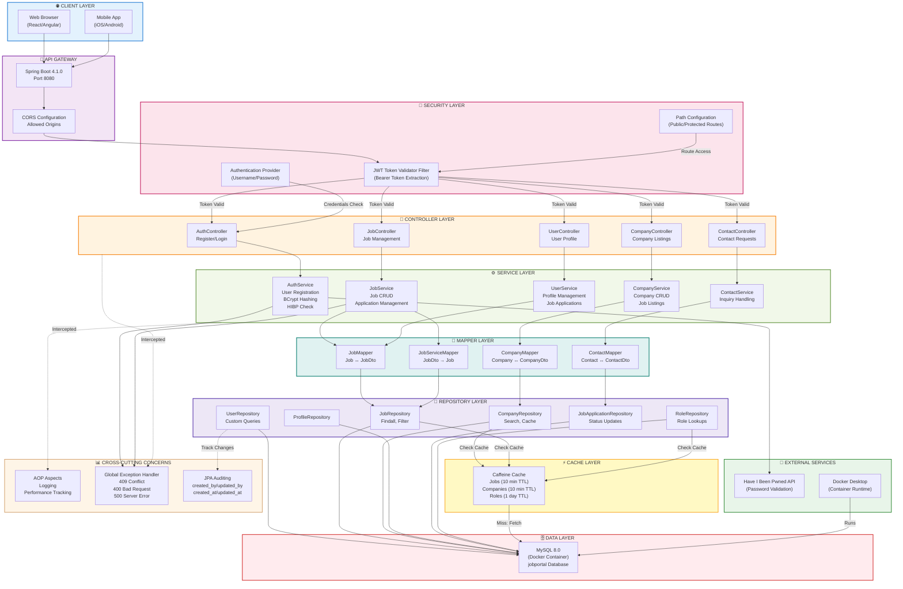
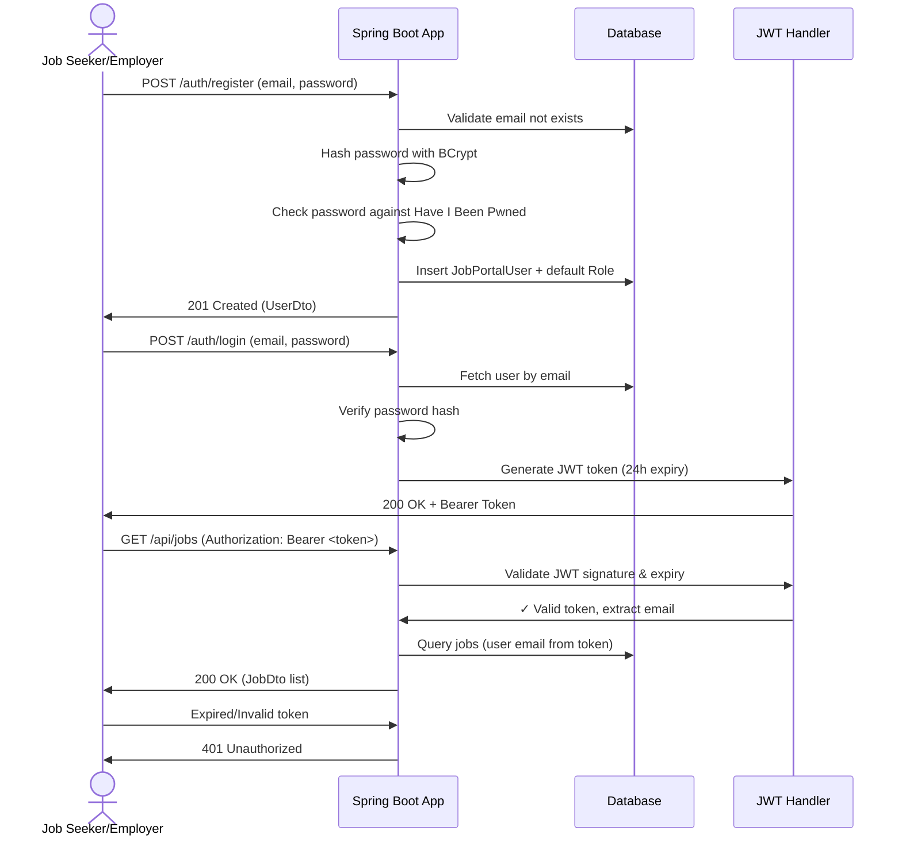
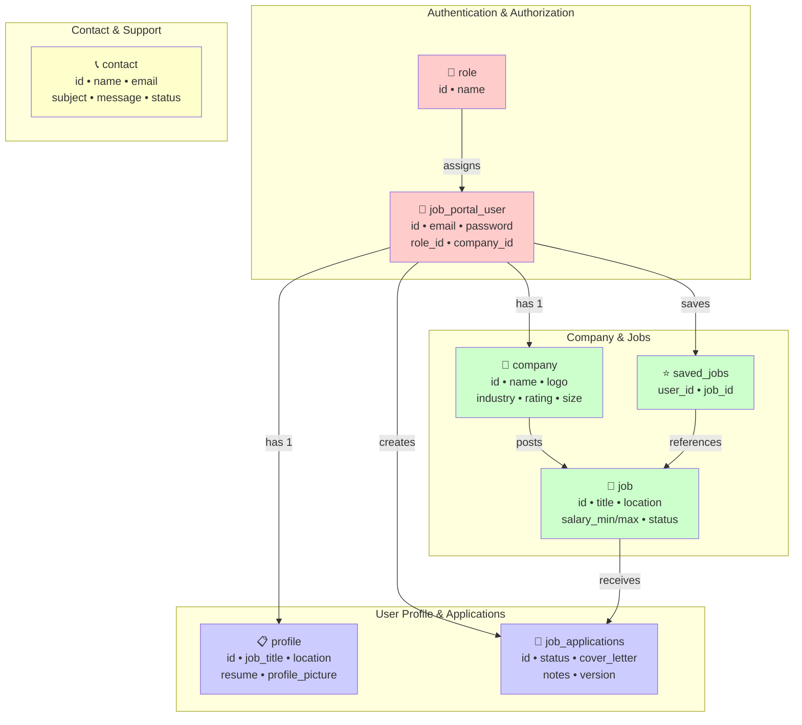
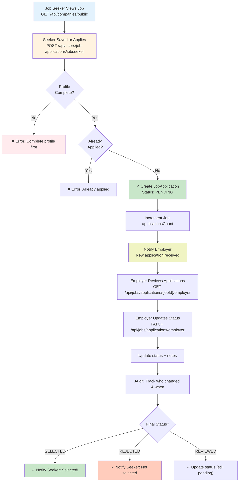

# Job Portal

A Spring Boot REST API for a job portal platform, supporting company listings, job postings, contact requests, and JWT-based authentication with role-based access control.

## Tech Stack

| Layer          | Technology                                |
|----------------|--------------------------------------------|
| Language       | Java 21                                    |
| Framework      | Spring Boot 4.1.0                          |
| Persistence    | Spring Data JPA / Hibernate                |
| Database       | MySQL 8+ (via Docker Compose)              |
| Security       | Spring Security, JJWT (JSON Web Tokens)    |
| API Docs       | springdoc-openapi (Swagger UI)             |
| Build Tool     | Maven                                      |
| Utilities      | Lombok, Jakarta Bean Validation            |

## High-Level Design (HLD)



**Data Flow:**
1. **Request** → Client sends HTTP request to Spring Boot API
2. **Security** → JWT Filter validates token, extracts user email
3. **Routing** → Controller handles request based on endpoint
4. **Business Logic** → Service executes business rules
5. **Transformation** → Mapper converts Entity ↔ DTO
6. **Data Access** → Repository queries MySQL or returns cached data
7. **Response** → Convert to JSON and send back to client
8. **Error Handling** → Global exception handler catches and formats errors
9. **Auditing** → AOP aspect logs all data changes with user info

## Project Structure

```
src/main/java/org/jobportal/portal/
├── auth/                      # Login/registration controller
├── company/                    # Company controller & service layer
├── contact/                    # Contact form controller & service layer
├── job/                        # Job management controller & service layer
├── user/                       # User management controller & service layer
├── security/                   # Spring Security config, JWT filter, auth provider, CORS
├── audit/                      # JPA auditing (created_by / updated_by resolution)
├── entity/                     # JPA entities (User, Company, Job, Role, Contact, Profile, JobApplication)
├── repository/                 # Spring Data JPA repositories with custom queries
├── dto/                        # Request/response DTOs (input/output mapping)
├── mapper/                     # Mapper components (Entity ↔ DTO transformations)
├── constants/                  # Shared application constants
├── util/                       # Helper utilities (transformation, logging)
├── cache/                      # Caching configuration (Caffeine)
├── exception/                  # Global exception handling
├── aspects/                    # AOP aspects (logging, auditing, validation)
└── config/                     # Web/MVC configuration
```

## Prerequisites

- JDK 21+
- Maven 3.9+ (or use the bundled `./mvnw`)
- Docker Desktop (the app manages its own MySQL container via Spring Boot Docker Compose support)

## Getting Started

### 1. Clone and configure environment variables

The application reads sensitive configuration from environment variables (see [Configuration](#configuration) below). At minimum, set `DATABASE_PASSWORD` — it is used both by the app's datasource connection and by the Dockerized MySQL container's root password (single source of truth, never hardcoded):

```bash
export DATABASE_PASSWORD=<your-secure-password>
```

### 2. Database

The project uses **Spring Boot's Docker Compose integration** — starting the app automatically starts a MySQL container defined in [`compose.yml`](./compose.yml) and stops it on shutdown. No manual `docker compose up` is required.

```yaml
# compose.yml
services:
  dbservice:
    image: mysql:latest
    container_name: jobportaldb
    ports:
      - "3306:3306"
    environment:
      MYSQL_ROOT_PASSWORD: ${DATABASE_PASSWORD}
      MYSQL_DATABASE: jobportal
```

**Schema Management:**
- **Development**: Set `spring.jpa.hibernate.ddl-auto=create-drop` to auto-create all tables on startup (data lost on restart)
- **Production**: Set `spring.jpa.hibernate.ddl-auto=validate` and manage schema manually via scripts

For **IntelliJ Ultimate**, generate DDL from JPA entities:
1. Open Database tool (View → Tool Windows → Database)
2. Add MySQL connection
3. Right-click connection → Generate DDL from Entities
4. Execute the generated SQL to create schema once

### 3. Seed reference data

Roles (`ROLE_JOB_SEEKER`, `ROLE_EMPLOYER`, `ROLE_ADMIN`) and any sample data are **not** committed to the repo (see `.gitignore`). Create your own seed script under `src/main/resources/sql/` and load it into the running container, e.g.:

```powershell
Get-Content "src/main/resources/sql/jobportal-data.sql" | docker exec -i jobportaldb mysql -u root -p$env:DATABASE_PASSWORD jobportal
```

> The `roles.name` column has a unique constraint — re-running the seed script without clearing existing rows first will fail with a duplicate-key error by design.

### 4. Run the application

```bash
./mvnw spring-boot:run
```

The API is available at `http://localhost:8080/api`.

### 5. API documentation

Swagger UI: `http://localhost:8080/api/swagger-ui.html`
OpenAPI spec: `http://localhost:8080/api/v3/api-docs`

## Configuration

All configuration lives in [`application.properties`](./src/main/resources/application.properties) and is overridable via environment variables:

| Variable              | Default        | Description                                  |
|-----------------------|----------------|-----------------------------------------------|
| `DATABASE_HOST`        | `localhost`    | MySQL host                                    |
| `DATABASE_PORT`        | `3306`         | MySQL port                                    |
| `DATABASE_NAME`        | `jobportal`    | MySQL schema name                             |
| `DATABASE_USERNAME`    | `root`         | MySQL username                                |
| `DATABASE_PASSWORD`    | *(required)*   | MySQL password                                |
| `JWT_SECRET_KEY`       | dev default    | HMAC signing secret for JWTs — **override in production** |
| `SHOW_SQL`             | `true`         | Log Hibernate SQL statements                  |
| `HIBERNATE_FORMAT_SQL` | `true`         | Pretty-print logged SQL                       |
| `LOG_LEVEL`            | `INFO`         | Log level for `org.jobportal.portal`          |
| `LOG_LEVEL_ERROR`      | `ERROR`        | Log level for the `security`/`contact` logging group |

> **Production checklist:** always set an explicit, high-entropy `JWT_SECRET_KEY` — the built-in default is for local development only.

## Authentication & Authorization

- Authentication is stateless, via a JWT bearer token issued on login (`POST /api/auth/login/public`) and validated on subsequent requests by a custom `JwtTokenVaidatorFilter`.
- New accounts are self-registered via `POST /api/auth/register/public` and are assigned the `ROLE_JOB_SEEKER` role by default.
- Public (unauthenticated) paths are declared in [`PathsConfig`](./src/main/java/org/jobportal/portal/security/PathsConfig.java); everything else under `/api/**` requires a valid `Authorization: Bearer <token>` header.
- Passwords are hashed with BCrypt and checked against the [Have I Been Pwned](https://haveibeenpwned.com/) API at registration time to reject compromised passwords.

## API Overview

### Public Endpoints (No Auth Required)

| Method | Endpoint                        | Description                                    |
|--------|---------------------------------|------------------------------------------------|
| POST   | `/api/auth/register/public`     | Register a new job-seeker account              |
| POST   | `/api/auth/login/public`        | Authenticate and receive JWT token (24h expiry)|
| GET    | `/api/companies/public`         | List all companies with their job postings     |
| POST   | `/api/contacts/public`          | Submit a contact/inquiry form                  |

### Secured Endpoints (JWT Required)

| Method | Endpoint                         | Description                          |
|--------|----------------------------------|--------------------------------------|
| GET    | `/api/users/{userId}`            | Get user profile                     |
| PUT    | `/api/users/{userId}`            | Update user profile                  |
| GET    | `/api/jobs`                      | List jobs (with filtering)           |
| POST   | `/api/jobs`                      | Create new job posting               |
| PUT    | `/api/jobs/{jobId}`              | Update job posting                   |
| POST   | `/api/jobs/{jobId}/apply`        | Apply for a job                      |
| GET    | `/api/profiles`                  | Get user profile details             |
| POST   | `/api/profiles`                  | Create/update user profile           |

All endpoints support **API versioning** via `version` query parameter or `Accept` header (e.g., `version=1.0`). See Swagger UI for full OpenAPI spec and request/response schemas.

## Authentication Flow



## Database Schema

Complete MySQL database schema with all tables, columns, data types, and relationships:

```sql
-- Roles Reference Table
CREATE TABLE role (
    id INT PRIMARY KEY AUTO_INCREMENT,
    name VARCHAR(50) NOT NULL UNIQUE,
    created_at TIMESTAMP DEFAULT CURRENT_TIMESTAMP
) ENGINE=InnoDB;

-- Users Table
CREATE TABLE job_portal_user (
    id BIGINT PRIMARY KEY AUTO_INCREMENT,
    email VARCHAR(255) NOT NULL UNIQUE,
    name VARCHAR(255),
    password VARCHAR(255) NOT NULL,
    mobile_number VARCHAR(20),
    role_id INT NOT NULL,
    company_id BIGINT,
    version INT DEFAULT 0,
    created_at TIMESTAMP DEFAULT CURRENT_TIMESTAMP,
    updated_at TIMESTAMP DEFAULT CURRENT_TIMESTAMP ON UPDATE CURRENT_TIMESTAMP,
    created_by VARCHAR(255),
    updated_by VARCHAR(255),
    FOREIGN KEY (role_id) REFERENCES role(id),
    FOREIGN KEY (company_id) REFERENCES company(id),
    INDEX idx_email (email),
    INDEX idx_role (role_id)
) ENGINE=InnoDB;

-- Companies Table
CREATE TABLE company (
    id BIGINT PRIMARY KEY AUTO_INCREMENT,
    name VARCHAR(255) NOT NULL,
    logo LONGBLOB,
    description LONGTEXT,
    industry VARCHAR(100),
    rating DECIMAL(3,2),
    size INT,
    founded INT,
    locations VARCHAR(255),
    employees INT,
    website VARCHAR(255),
    version INT DEFAULT 0,
    created_at TIMESTAMP DEFAULT CURRENT_TIMESTAMP,
    updated_at TIMESTAMP DEFAULT CURRENT_TIMESTAMP ON UPDATE CURRENT_TIMESTAMP,
    INDEX idx_name (name)
) ENGINE=InnoDB;

-- Jobs Table
CREATE TABLE job (
    id BIGINT PRIMARY KEY AUTO_INCREMENT,
    company_id BIGINT NOT NULL,
    title VARCHAR(255) NOT NULL,
    location VARCHAR(255),
    work_type VARCHAR(50),
    job_type VARCHAR(50),
    category VARCHAR(100),
    experience_level VARCHAR(50),
    salary_min DECIMAL(10,2),
    salary_max DECIMAL(10,2),
    salary_currency VARCHAR(10),
    salary_period VARCHAR(20),
    description LONGTEXT,
    requirements LONGTEXT,
    benefits LONGTEXT,
    posted_date TIMESTAMP,
    application_deadline TIMESTAMP,
    applications_count INT DEFAULT 0,
    featured BOOLEAN DEFAULT FALSE,
    urgent BOOLEAN DEFAULT FALSE,
    remote BOOLEAN DEFAULT FALSE,
    status VARCHAR(20) DEFAULT 'DRAFT',
    version INT DEFAULT 0,
    created_at TIMESTAMP DEFAULT CURRENT_TIMESTAMP,
    updated_at TIMESTAMP DEFAULT CURRENT_TIMESTAMP ON UPDATE CURRENT_TIMESTAMP,
    FOREIGN KEY (company_id) REFERENCES company(id),
    INDEX idx_company (company_id),
    INDEX idx_status (status),
    INDEX idx_posted_date (posted_date)
) ENGINE=InnoDB;

-- User Profiles Table
CREATE TABLE profile (
    id BIGINT PRIMARY KEY AUTO_INCREMENT,
    user_id BIGINT NOT NULL UNIQUE,
    job_title VARCHAR(255),
    location VARCHAR(255),
    experience_level VARCHAR(50),
    professional_bio LONGTEXT,
    portfolio_website VARCHAR(255),
    profile_picture LONGBLOB,
    profile_picture_name VARCHAR(255),
    profile_picture_type VARCHAR(100),
    resume LONGBLOB,
    resume_name VARCHAR(255),
    resume_type VARCHAR(100),
    version INT DEFAULT 0,
    created_at TIMESTAMP DEFAULT CURRENT_TIMESTAMP,
    updated_at TIMESTAMP DEFAULT CURRENT_TIMESTAMP ON UPDATE CURRENT_TIMESTAMP,
    FOREIGN KEY (user_id) REFERENCES job_portal_user(id),
    INDEX idx_user (user_id)
) ENGINE=InnoDB;

-- Job Applications Table
CREATE TABLE job_applications (
    id BIGINT PRIMARY KEY AUTO_INCREMENT,
    user_id BIGINT NOT NULL,
    job_id BIGINT NOT NULL,
    applied_at TIMESTAMP,
    status VARCHAR(50) DEFAULT 'PENDING',
    cover_letter LONGTEXT,
    notes LONGTEXT,
    version INT DEFAULT 0,
    created_at TIMESTAMP DEFAULT CURRENT_TIMESTAMP,
    updated_at TIMESTAMP DEFAULT CURRENT_TIMESTAMP ON UPDATE CURRENT_TIMESTAMP,
    created_by VARCHAR(255),
    updated_by VARCHAR(255),
    FOREIGN KEY (user_id) REFERENCES job_portal_user(id),
    FOREIGN KEY (job_id) REFERENCES job(id),
    UNIQUE KEY unique_application (user_id, job_id),
    INDEX idx_user (user_id),
    INDEX idx_job (job_id),
    INDEX idx_status (status)
) ENGINE=InnoDB;

-- Contact Form Submissions Table
CREATE TABLE contact (
    id BIGINT PRIMARY KEY AUTO_INCREMENT,
    name VARCHAR(255),
    email VARCHAR(255),
    user_type VARCHAR(50),
    subject VARCHAR(255),
    message LONGTEXT,
    status VARCHAR(50) DEFAULT 'New',
    created_at TIMESTAMP DEFAULT CURRENT_TIMESTAMP,
    INDEX idx_email (email),
    INDEX idx_status (status)
) ENGINE=InnoDB;

-- Saved Jobs Junction Table (Many-to-Many)
CREATE TABLE saved_jobs (
    user_id BIGINT NOT NULL,
    job_id BIGINT NOT NULL,
    saved_at TIMESTAMP DEFAULT CURRENT_TIMESTAMP,
    PRIMARY KEY (user_id, job_id),
    FOREIGN KEY (user_id) REFERENCES job_portal_user(id),
    FOREIGN KEY (job_id) REFERENCES job(id)
) ENGINE=InnoDB;
```

## Data Model (Entity Relationships)



**Key Constraints:**
- ✅ **Unique**: `email`, `role.name`, `(user_id, job_id)` in job_applications
- ✅ **Indexes**: `email`, `status`, `posted_date`, `company_id` for fast queries
- ✅ **Foreign Keys**: All references to parent tables with cascading deletes
- ✅ **Version**: All mutable tables have optimistic locking column

## Job Application Flow



## Mapper Layer (Entity ↔ DTO Transformation)

The application uses a dedicated **mapper layer** for separating data transformation concerns:

| Mapper Class | Responsibility |
|--------------|-----------------|
| `JobMapper` | Convert `Job` entity ↔ `JobDto` |
| `CompanyMapper` | Convert `Company` entity ↔ `CompanyDto`, compose with `JobMapper` |
| `ContactMapper` | Convert `Contact` entity ↔ `ContactRequestDto/ContactResponseDto` |
| `JobServiceMapper` | Convert `JobDto` → `Job` entity (DTO request to persistence) |

**Benefits:**
- ✅ Clear separation of concerns (service logic vs. transformation)
- ✅ Reusable across multiple services
- ✅ Easy to test and modify transformation rules
- ✅ Reduces boilerplate in service classes

## Job Management API

The `JobController` provides endpoints for employers to manage job postings and review applications:

### Employer Endpoints

| Method | Endpoint | Description |
|--------|----------|-------------|
| GET | `/api/jobs/employer` | Retrieve all jobs posted by logged-in employer |
| POST | `/api/jobs/employer` | Create a new job posting (starts in DRAFT status) |
| PATCH | `/api/jobs/{jobId}/status/employer` | Update job status (DRAFT → ACTIVE → CLOSED) |
| GET | `/api/jobs/applications/{jobId}/employer` | Get all applications for a specific job |
| PATCH | `/api/jobs/applications/employer` | Update application status & notes (PENDING → REVIEWED → SELECTED/REJECTED) |

**Status Transitions:**
- **Job**: `DRAFT` → `ACTIVE` (published) → `CLOSED` (no longer hiring)
- **Application**: `PENDING` → `REVIEWED` (viewed by employer) → `SELECTED` or `REJECTED`

### Request/Response Examples

**Create Job:**
```json
POST /api/jobs/employer
{
  "title": "Senior Java Developer",
  "location": "San Francisco, CA",
  "workType": "Hybrid",
  "jobType": "Full-time",
  "salaryMin": 120000,
  "salaryMax": 160000,
  "description": "...",
  "requirements": "5+ years Java, Spring Boot...",
  "benefits": "Health insurance, 401k..."
}
```

**Update Application Status:**
```json
PATCH /api/jobs/applications/employer
{
  "applicationId": 42,
  "status": "SELECTED",
  "notes": "Passed technical interview, proceeding to offer stage"
}
```

## Concurrency & Optimistic Locking

All mutable entities (`Job`, `Company`, `Profile`, `JobPortalUser`, `JobApplication`) include a **`@Version` field** for optimistic locking:

```java
@Version
private Integer version;
```

**How it works:**
1. When a row is fetched, its current version is read
2. If two users modify the same row concurrently, the second update fails with `OptimisticLockingFailureException`
3. The application catches this and returns **HTTP 409 Conflict** with a user-friendly message
4. Client is notified to refresh data and retry

**Example:** Two employers both editing the same job posting → only first succeeds, second gets 409 and must retry.

## Dependency Injection & Lombok

This project uses **constructor injection** with Lombok's `@RequiredArgsConstructor` — no `@Autowired` field injection. Benefits:

- ✅ Immutable dependencies (`final` fields)
- ✅ Easy to test (pass mocks to constructor)
- ✅ Clear dependency declaration in method signature
- ✅ Zero boilerplate (Lombok generates constructors)

Example:
```java
@Service
@RequiredArgsConstructor
public class CompanyServiceImpl implements ICompanyService {
    private final CompanyRepository companyRepository;  // Injected automatically
    
    @Override
    public List<CompanyDto> getAllCompanies() {
        return companyRepository.findAll().stream()
                .map(ApplicationUtility::transformCompanyToDto)
                .toList();
    }
}
```

## Error Handling

The application uses `GlobalExceptionHandler` to provide consistent, user-friendly error responses:

| Exception | HTTP Status | Message |
|-----------|-------------|---------|
| `OptimisticLockingFailureException` | 409 Conflict | "The resource was modified by another user. Please refresh and try again." |
| `MethodArgumentNotValidException` | 400 Bad Request | Validation error details (field, message) |
| `RuntimeException` | 500 Internal Server Error | Generic error message |
| `InvalidDataAccessResourceUsageException` | 500 Internal Server Error | Database access error |

**Example 409 Response:**
```json
{
  "timestamp": "2026-01-15T14:30:00Z",
  "status": 409,
  "message": "The resource was modified by another user. Please refresh and try again."
}
```

## Data Transformation (DTO ↔ Entity)

Always use explicit helper methods in `ApplicationUtility` for complex transformations:

- **Entity → DTO** (response): Use `ApplicationUtility.transformXxxToDto()` — manually GET from entity, populate DTO
- **DTO → Entity** (request): Use `ApplicationUtility.transformDtoToXxx()` — manually SET into entity, handle nested objects

**Never use `BeanUtils.copyProperties` for nested objects** — it silently loses data.

## Building

```bash
./mvnw clean package
```

Produces an executable jar at `target/portal-0.0.1-SNAPSHOT.jar`:

```bash
java -jar target/portal-0.0.1-SNAPSHOT.jar
```

## Running Tests

```bash
./mvnw test
```

## Environment Profiles

The application supports multiple deployment profiles via `spring.profiles.active`:

- **`dev`** (default): Local development with debug logging
- **`qa`**: Quality assurance environment (see `application-qa.properties`)
- **`prod`**: Production deployment (see `application-prod.properties`, requires secure env vars)

Set via environment variable:
```bash
export SPRING_PROFILES_ACTIVE=prod
```

Or in `application.properties`:
```properties
spring.profiles.active=prod
```

## License

Proprietary — all rights reserved unless a license is added to this repository.
